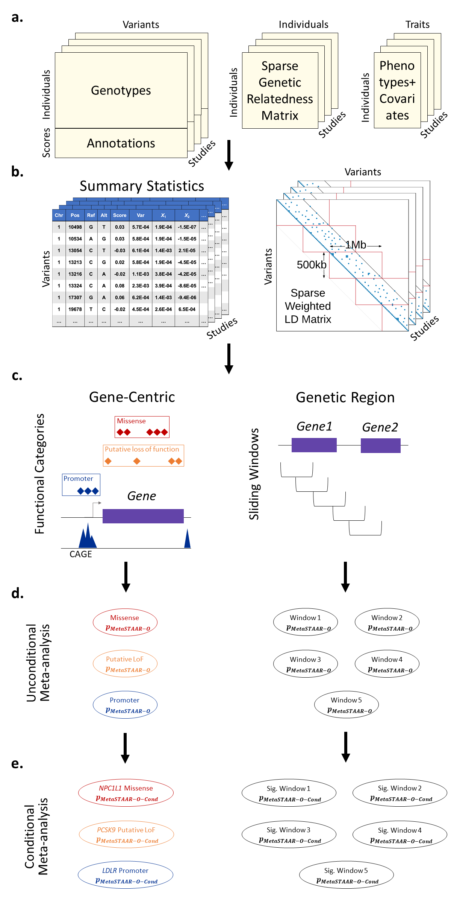

[](https://github.com/xihaoli/MetaSTAAR/actions)
[](https://app.travis-ci.com/github/xihaoli/MetaSTAAR)
[](https://ci.appveyor.com/project/xihaoli/metastaar/branch/main)
[](https://www.gnu.org/licenses/gpl-3.0)

# MetaSTAAR (Meta-analysis of variant-Set Test for Association using Annotation infoRmation)
This is an R package for performing MetaSTAAR procedure in whole-genome sequencing studies.
## Description
MetaSTAAR is an R package for performing Meta-analysis of variant-Set Test for Association using Annotation infoRmation (MetaSTAAR) procedure in whole-genome sequencing (WGS) studies.
## Workflow Overview

## Prerequisites
<a href="https://www.r-project.org">R</a> (recommended version >= 3.5.1)

For optimal computational performance, it is recommended to use an R version configured with the Intel Math Kernel Library (or other fast BLAS/LAPACK libraries). See the <a href="https://software.intel.com/en-us/articles/using-intel-mkl-with-r">instructions</a> on building R with Intel MKL.
## Dependencies
MetaSTAAR links to R packages <a href="https://cran.r-project.org/web/packages/Rcpp/index.html">Rcpp</a>, <a href="https://cran.r-project.org/web/packages/RcppArmadillo/index.html">RcppArmadillo</a> and <a href="https://https://github.com/xihaoli/STAAR">STAAR</a>, and also imports R packages <a href="https://cran.r-project.org/web/packages/Rcpp/index.html">Rcpp</a>, <a href="https://https://github.com/xihaoli/STAAR">STAAR</a>, <a href="https://cran.r-project.org/web/packages/Matrix/index.html">Matrix</a>, <a href="https://cran.r-project.org/web/packages/dplyr/index.html">dplyr</a>, <a href="https://cran.r-project.org/web/packages/expm/index.html">expm</a>, <a href="https://cran.r-project.org/web/packages/MASS/index.html">MASS</a>. These dependencies should be installed before installing MetaSTAAR.
## Installation
```
library(devtools)
devtools::install_github("xihaoli/MetaSTAAR",ref="main")
```
## Usage
Please see the <a href="docs/MetaSTAAR_manual.pdf">**MetaSTAAR** user manual</a> for detailed usage of MetaSTAAR package. The scripts used to generate results in the <a href="https://doi.org/10.1038/s41588-022-01225-6">manuscript</a> are available on <a href="https://doi.org/10.5281/zenodo.6668274">_Zenodo_</a>.
## Data Availability
The whole-genome individual functional annotation data assembled from a variety of sources and the computed annotation principal components are available at the [Functional Annotation of Variant - Online Resource (FAVOR)](https://favor.genohub.org) site and [FAVOR Essential Database](https://doi.org/10.7910/DVN/1VGTJI).
## Version
The current version is 0.9.6.1 (December 23, 2022).
## Citation
If you use **MetaSTAAR** for your work, please cite:

Xihao Li, Corbin Quick, Hufeng Zhou, Sheila M. Gaynor, Yaowu Liu, Han Chen, Margaret Sunitha Selvaraj, Ryan Sun, Rounak Dey, Donna K. Arnett, Lawrence F. Bielak, Joshua C. Bis, John Blangero, Eric Boerwinkle, Donald W. Bowden, Jennifer A. Brody, Brian E. Cade, Adolfo Correa, L. Adrienne Cupples, Joanne E. Curran, Paul S. de Vries, Ravindranath Duggirala, Barry I. Freedman, Harald H. H. Göring, Xiuqing Guo, Jeffrey Haessler, Rita R. Kalyani, Charles Kooperberg, Brian G. Kral, Leslie A. Lange, Ani Manichaikul, Lisa W. Martin, Stephen T. McGarvey, Braxton D. Mitchell, May E. Montasser, Alanna C. Morrison, Take Naseri, Jeffrey R. O'Connell, Nicholette D. Palmer, Patricia A. Peyser, Bruce M. Psaty, Laura M. Raffield, Susan Redline, Alexander P. Reiner, Muagututi’a Sefuiva Reupena, Kenneth M. Rice, Stephen S. Rich, Colleen M. Sitlani, Jennifer A. Smith, Kent D. Taylor, Ramachandran S. Vasan, Cristen J. Willer, James G. Wilson, Lisa R. Yanek, Wei Zhao, NHLBI Trans-Omics for Precision Medicine (TOPMed) Consortium, TOPMed Lipids Working Group, Jerome I. Rotter, Pradeep Natarajan, Gina M. Peloso, Zilin Li, & Xihong Lin. (2022). **Powerful, scalable and resource-efficient meta-analysis of rare variant associations in large whole genome sequencing studies**. _Nature Genetics_. DOI: <a href="https://doi.org/10.1038/s41588-022-01225-6">10.1038/s41588-022-01225-6</a>.
## License
This software is licensed under GPLv3.


[GNU General Public License, GPLv3](http://www.gnu.org/copyleft/gpl.html)
